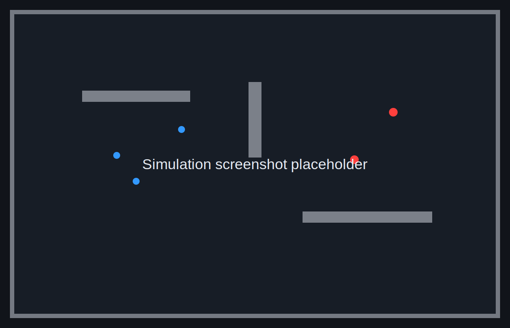

# Rust Multi-Agent Pursuit-Evasion

A lightweight 2D multi-agent simulation built with Rust, Bevy, and Rapier.

The project is a compact pursuit-evasion environment: blue hiders move through an arena while red seekers pursue visible targets. Walls and obstacles are handled by Rapier physics, and line-of-sight is blocked by fixed colliders. The simulation is small enough to read in one sitting, while still showing the core pieces of an actor simulation loop.



## Run

```bash
source "$HOME/.cargo/env"
cargo run
```

Useful development checks:

```bash
cargo check
cargo fmt
cargo clippy
cargo run --release
```

## What The Demo Shows

- Blue hiders flee from red seekers.
- Red seekers chase the nearest visible hider.
- Walls and obstacles block movement through Rapier colliders.
- Walls also block line-of-sight, so seekers patrol when no hider is visible.
- Captured hiders turn gray and shrink.
- The UI reports alive hiders, captured hiders, and FPS.

## Project Structure

```text
src/
  main.rs        app setup, constants, plugin wiring
  components.rs ECS component/resource definitions
  systems.rs    spawning, policy, movement, physics queries, UI updates
```

## Design Notes

- Agents are Bevy ECS entities with typed components.
- Behavior policies write desired velocities; movement is applied through Rapier's kinematic character controller.
- Physics runs on `FixedUpdate`, while policy updates run at a lower control frequency.
- Seekers use Rapier ray casts against fixed bodies for line-of-sight.
- The visual demo defaults to a larger agent count so crowd behavior and performance are easy to observe.

## Configuration

The main demo constants live in `src/main.rs`:

- arena size
- number of hiders and seekers
- agent radius and speed
- capture distance
- sight range
- physics and control frequencies

## Roadmap

- Add a reset key and deterministic seed.
- Add benchmark mode for headless stepping.
- Add a minimal RL-style API: `reset()` and `step(actions)`.
- Add movable boxes or simple tools after the core simulator is stable.
